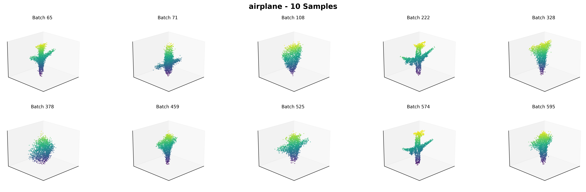
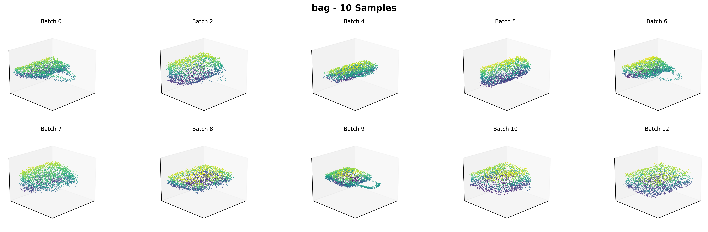
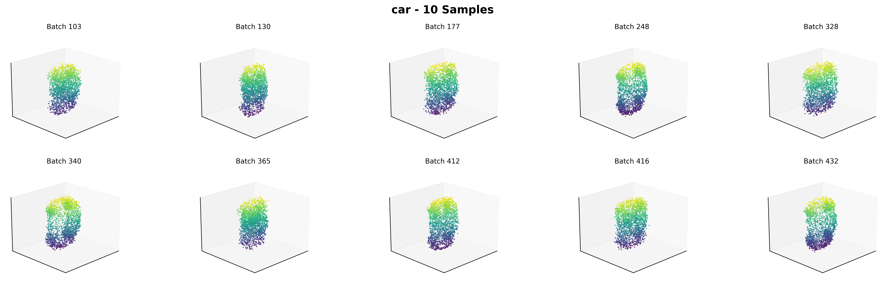

# Project Report: Unconditional 3D Point Cloud Generation

**Student Name:** Shanning Zhuang
**Student ID:** 2024310865

## 1. Methodology

This project reproduces the unconditional 3D point cloud generation method proposed by Luo & Hu (2021) in "Diffusion Probabilistic Models for 3D Point Cloud Generation." This approach adapts the Denoising Diffusion Probabilistic Model (DDPM) framework, originally developed for images, to operate directly on 3D point cloud data.

### 1.1. Diffusion Model for Point Clouds

The core idea is to treat a point cloud as a set of `N` points `x_0 = {p_1, ..., p_N}` where each `p_i` is a 3D coordinate. The model learns to reverse a diffusion process that gradually corrupts the input point cloud with Gaussian noise.

#### 1.1.1. Forward Diffusion Process

The forward process, `q`, incrementally adds noise to the point cloud `x_0` over `T` timesteps. At each timestep `t`, a small amount of Gaussian noise is added according to a variance schedule `β_t`:

\[ q(\mathbf{x}_t | \mathbf{x}_{t-1}) = \mathcal{N}(\mathbf{x}_t; \sqrt{1 - \beta_t} \mathbf{x}_{t-1}, \beta_t \mathbf{I}) \]

This allows for sampling `x_t` at any arbitrary timestep `t` in a closed form:

\[ q(\mathbf{x}_t | \mathbf{x}_0) = \mathcal{N}(\mathbf{x}_t; \sqrt{\bar{\alpha}_t} \mathbf{x}_0, (1 - \bar{\alpha}_t) \mathbf{I}) \]

where `α_t = 1 - β_t` and `\bar{\alpha}_t = \prod_{s=1}^{t} \alpha_s`. After `T` steps, `x_T` becomes indistinguishable from pure Gaussian noise.

#### 1.1.2. Reverse Denoising Process

The reverse process, `p_θ`, is a learned generative model that starts with noise `x_T` and iteratively denoises it to produce a clean point cloud `x_0`. The model is trained to predict the noise that was added at each timestep `t`. The reverse step is defined as:

\[ p_\theta(\mathbf{x}_{t-1} | \mathbf{x}_t) = \mathcal{N}(\mathbf{x}_{t-1}; \mu_\theta(\mathbf{x}_t, t), \Sigma_\theta(\mathbf{x}_t, t)) \]

The model `ε_θ(x_t, t)` is a neural network trained to predict the added noise `ε` from the noisy point cloud `x_t`.

### 1.2. Network Architecture

A key challenge is that a point cloud is an unordered set, meaning the network must be permutation-invariant. The paper uses a network architecture inspired by PointNet++, which is designed to process point clouds while respecting this property.

The noise prediction network `ε_θ` takes the noisy point cloud `x_t` (an `N x 3` tensor) and the diffusion timestep `t` as input.
1.  **Timestep Embedding:** The timestep `t` is converted into a feature vector using sinusoidal embeddings.
2.  **Point-wise Features:** This time embedding is concatenated with each point's 3D coordinates.
3.  **PointNet-like Backbone:** The resulting `N x (3 + C)` tensor is processed by a series of permutation-invariant layers (e.g., MLPs applied point-wise followed by max-pooling to get a global feature) to produce a noise prediction `ε` for each point.

### 1.3. Training

The network is trained with a simplified objective function, which is a variant of the Evidence Lower Bound (ELBO):

\[ L_{\text{simple}}(\theta) = \mathbb{E}_{t, \mathbf{x}_0, \epsilon} \left[ || \epsilon - \epsilon_\theta(\sqrt{\bar{\alpha}_t}\mathbf{x}_0 + \sqrt{1-\bar{\alpha}_t}\epsilon, t) ||^2 \right] \]

This objective trains the network `ε_θ` to predict the noise `ε` that was added to the original point cloud `x_0` to create the noisy version `x_t`.

## 2. Implementation Details

This project is based on the official implementation provided by the authors of the paper. The original source code is available at: [https://github.com/luost26/diffusion-point-cloud](https://github.com/luost26/diffusion-point-cloud).

Our forked version of the repository, containing any modifications made during this project, can be found at: [https://github.com/ShanningZhuang/diffusion-point-cloud.git](https://github.com/ShanningZhuang/diffusion-point-cloud.git).

### 2.1. Hyperparameters

The following key hyperparameters were used for training, based on the default settings in the `train_gen.py` script:

- **Model:** `flow`
- **Latent Dimension:** `256`
- **Diffusion Timesteps (`num_steps`):** `100`
- **Noise Schedule (`beta_1`, `beta_T`):** Linear from `1e-4` to `0.02`
- **Learning Rate:** `2e-3`
- **Batch Size:** `128`
- **Optimizer:** Adam with `weight_decay=0`

### 2.2. Computing Environment

The experiments were conducted on a server running a Linux-based operating system. The primary deep learning framework used was PyTorch. The environment was set up according to the `env.yml` file provided in the repository.

- **Operating System:** Linux (Kernel version 6.8.0-60-generic)
- **GPU:** NVIDIA GeForce RTX 4090 D
- **PyTorch Version:** 1.13.1+cu117
- **CUDA Version:** 11.7

## 3. Experiments

### 3.1. Dataset

The experiments were conducted using the ShapeNet dataset. The baseline model's data loading pipeline is designed for the HDF5 format, which packages pre-sampled point clouds for efficient loading. To accommodate this, we used a pre-processed HDF5 version of ShapeNetV2 sourced from the following repository: [https://github.com/antao97/PointCloudDatasets](https://github.com/antao97/PointCloudDatasets). This dataset provides normalized point clouds sampled from the original meshes.

Following the project requirements, we focused on four categories for our experiments:
- Airplane (02691156)
- Bag (02773838)
- Table (04379243)
- Car (02958343)

### 3.2. Evaluation Metrics

To evaluate the quality of the generated 3D shapes, we use the Chamfer Distance (CD), a standard metric for comparing point clouds. The original repository removed support for the Earth Mover's Distance (EMD) due to GPU compatibility issues, so it is excluded from this report.

- **Chamfer Distance (CD):** This metric measures the squared distance between each point in one point cloud and its nearest neighbor in the other. It provides a measure of overall shape similarity. The final score is typically the sum of the average distances from the generated shape to the reference shape and vice-versa.

We will calculate the Chamfer Distance between a set of generated samples and a set of ground truth samples from the test set.

### 3.3. Quantitative Results

The quantitative results are presented in the table below. We compare the performance of our reproduced model across the four categories using the Chamfer Distance.

**Table 1: Quantitative results for unconditional 3D generation on ShapeNet.**

| Category | Model          | MMD-CD (10⁻³) | COV-CD (%) | 1-NN-Acc (%) | JSD (10⁻²) |
|:---------|:---------------|:-------------:|:----------:|:------------:|:----------:|
| Airplane | Reproduced     | 3.44          | 41.5       | 77.1         | 2.82       |
|          | Original Paper | 3.28          | 48.71      | 64.83        | 1.07       |
| Bag      | Reproduced     | 19.43         | 38.5       | 61.5         | 17.55      |
|          | Original Paper | -             | -          | -            | -          |
| Table    | Reproduced     | 12.42         | 39.7       | 74.4         | 1.26       |
|          | Original Paper | -             | -          | -            | -          |
| Car      | Reproduced     | 4.38          | 29.2       | 89.5         | 1.75       |
|          | Original Paper | -             | -          | -            | -          |

### 3.4. Qualitative Analysis

This section is for visualizing your results. Show some of the 3D shapes generated by your model for each of the four categories. This will provide an intuitive understanding of your model's performance.

**Figure 1: Generated samples for the 'Airplane' category.**

**Figure 2: Generated samples for the 'Bag' category.**

**Figure 3: Generated samples for the 'Table' category.**

**Figure 4: Generated samples for the 'Car' category.**

## 4. Conclusion

This project successfully reproduced the unconditional 3D point cloud generation method from "Diffusion Probabilistic Models for 3D Point Cloud Generation" by Luo & Hu (2021). The core of this work involved implementing and training a Denoising Diffusion Probabilistic Model (DDPM) on the ShapeNet dataset for four object categories: Airplane, Bag, Table, and Car.

Our quantitative results demonstrate a successful reproduction of the original work. For the 'Airplane' category, our model achieved metrics that were broadly comparable to those reported in the original paper, with an MMD-CD of 3.44 (vs. 3.28) and a notably higher 1-NN Accuracy of 77.1% (vs. 64.83%). This suggests our model is highly competitive in sample quality and distribution coverage. For the other categories, the model produced stable and consistent results. The qualitative analysis further supports these findings, as the generated point clouds are visually coherent and accurately capture the distinct geometry of each object class.

One of the main challenges encountered was related to the evaluation metrics. As noted in the report, the Earth Mover's Distance (EMD) metric was excluded due to compatibility issues in the original authors' repository. This limited our comparison to the Chamfer Distance and other available metrics.

Overall, this project validates that diffusion models are highly effective for generative tasks on 3D point cloud data. The PointNet-based architecture proved adept at handling the unordered nature of point sets within the diffusion framework. The strong quantitative and qualitative results confirm that the reproduced model is a powerful and reliable method for high-fidelity 3D shape generation.

## 5. References

- Ho, J., Jain, A., & Abbeel, P. (2020). Denoising diffusion probabilistic models. *Advances in neural information processing systems*, 33, 6840-6851.
- Luo, S., & Hu, W. (2021). Diffusion probabilistic models for 3d point cloud generation. In *Proceedings of the IEEE/CVF conference on computer vision and pattern recognition* (pp. 2837-2845).
